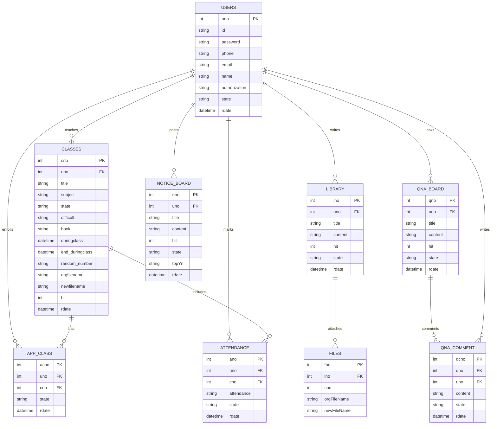

# AtemProject (teamproject_1st)

JSP/Servlet 기반의 간단한 LMS + 출결 관리 웹 애플리케이션입니다.

Front Controller 패턴으로 공지/자료실/Q&A/강의/출결/마이페이지 기능을 모듈화했고, 권한(A/T/S)에 따라 화면과 동작이 달라집니다.

---
📑 목차
프로젝트 개요
핵심 기능
기술 스택
프로젝트 구조
ERD
데이터 모델 (VO 기준)
라우팅 개요
라우팅 구조 (Front Controller)
사용자 (User)
강의 (Class)
공지 (Notice)
자료실 (Library)
Q&A & 댓글
통합 검색
마이페이지
출결 (Attendance) 모듈 — 자세한 흐름
1) 출결 리스트 (강사·학생 공통 진입)
2) 수강 중 강의 (학생용 정보 카드)
3) 출결 관리 (강사용, 특정 날짜의 명단·상태)
4) 인증코드 발급 (강사용)
5) 출석체크 (학생용, 인증코드 기반)
6) 출석정보 (개인 요약 캘린더)
권한별 기능 요약

## 핵심 기능

- **인증/세션**
  - 로그인, 로그아웃
  - 세션에 `loginUser` 저장(권한, 사용자 식별자 등 포함)
  - 권한: A(관리자) / T(강사) / S(학생)

- **공지사항(관리자)**
  - 목록, 상세, 등록, 수정, 삭제
  - 관리자만 작성·수정·삭제 가능

- **자료실(강사, 파일 업로드)**
  - 목록, 상세, 등록, 수정, 삭제
  - COS 라이브러리 사용 파일 업로드 → 서버 `/upload` 저장

- **Q&A(학생 질문, 강사 답변)**
  - 학생: 질문(게시글) CRUD
  - 강사: 댓글(답변) CRUD (일부 AJAX 수정 처리)

- **강의/수강신청/출결**
  - 관리자: 강의 등록/수정/삭제
  - 학생: 강의 상세에서 수강신청
  - 출결: 강사용 수업별 체크(수기/AJAX), 학생용 인증코드 출석

- **마이페이지 & 관리자 페이지**
  - 내 정보 및 연락처 수정, 수강 중/종료 강의 조회
  - 관리자: 사용자 목록 페이징 + 권한 변경(AJAX)

---

## 기술 스택

- **Backend**: Java (JSP, Servlet, JDBC)
- **Frontend**: JSP, HTML5, CSS3, JavaScript(jQuery)
- **Database**: MySQL 8.x
- **서버/IDE**: Apache Tomcat 9, Eclipse
- **라이브러리**
  - `mysql-connector-j-8.4.0.jar` (JDBC 드라이버)
  - `cos-05Nov2002.jar` (파일 업로드)
  - `json-simple-1.1.1.jar` (경량 JSON 처리)

---

## 프로젝트 구조
```text
.
├─ LICENSE
├─ README.md
├─ ppt/
│  └─ (발표 자료 .pptx)
├─ project_structure.txt
└─ teamproject_1st
   ├─ build/
   │  └─ classes/
   ├─ document/
   │  └─ SQL/
   │     ├─ DB.sql                 # 초기 스키마/샘플데이터
   │     └─ NewFile.html
   └─ src/
      └─ main/
         ├─ java/
         │  └─ FrontController/
         │     ├─ FrontController.java          # 진입점(라우팅)
         │     ├─ AttendanceController.java     # 출결
         │     ├─ ClassController.java          # 강의/수강신청
         │     ├─ IndexLibraryController.java   # 메인-자료실 섹션
         │     ├─ IndexNoticeController.java    # 메인-공지 섹션
         │     ├─ MyPageController.java         # 마이페이지/관리자
         │     ├─ SearchController.java         # 통합 검색
         │     ├─ UserController.java           # 사용자/세션
         │     ├─ library_controller.java       # 자료실
         │     ├─ notice_controller.java        # 공지
         │     ├─ qna_controller.java           # Q&A
         │     ├─ util/
         │     │  ├─ DBConn.java                # JDBC 연결 헬퍼
         │     │  └─ PagingUtil.java            # 공통 페이징
         │     └─ vo/                           # VO(DTO)
         │        ├─ UserVO.java
         │        ├─ ClassVO.java
         │        ├─ App_classVO.java
         │        ├─ AttendanceVO.java
         │        ├─ NoticeVO.java
         │        ├─ libraryVO.java
         │        ├─ qnaVO.java
         │        ├─ commentVO.java
         │        └─ SearchVO.java
         └─ webapp/
            ├─ META-INF/
            │  └─ MANIFEST.MF
            ├─ WEB-INF/
            │  ├─ web.xml                       # *.do 매핑(FrontController)
            │  ├─ lib/
            │  │  ├─ cos-05Nov2002.jar
            │  │  ├─ json-simple-1.1.1.jar
            │  │  └─ mysql-connector-j-8.4.0.jar
            │  ├─ attendance/
            │  │  ├─ attendanceCheck.jsp
            │  │  ├─ attendanceClass.jsp
            │  │  ├─ attendanceInfoView.jsp
            │  │  ├─ attendanceList.jsp
            │  │  └─ attendanceView.jsp
            │  ├─ class/
            │  │  ├─ class_add.jsp
            │  │  ├─ class_list.jsp
            │  │  ├─ class_modify.jsp
            │  │  ├─ class_view.jsp
            │  │  └─ teacher_view.jsp
            │  ├─ index_search/index_search.jsp
            │  ├─ library_board/
            │  │  ├─ library_list.jsp
            │  │  ├─ library_modify.jsp
            │  │  ├─ library_view.jsp
            │  │  └─ library_write.jsp
            │  ├─ notice_board/
            │  │  ├─ notice_list.jsp
            │  │  ├─ notice_modify.jsp
            │  │  ├─ notice_view.jsp
            │  │  └─ notice_write.jsp
            │  ├─ qna_board/
            │  │  ├─ qna_list.jsp
            │  │  ├─ qna_modify.jsp
            │  │  ├─ qna_view.jsp
            │  │  └─ qna_write.jsp
            │  └─ user/
            │     ├─ join.jsp
            │     ├─ login.jsp
            │     └─ logout.jsp
            ├─ include/
            │  ├─ header.jsp
            │  └─ footer.jsp
            ├─ index.jsp                         # 메인
            ├─ js/jquery-3.7.1.js
            ├─ teamProject.erm                   # ERD
            └─ upload/                           # 업로드 저장소
```
---

## ERD



---

## 데이터 모델(VO 기준 개요)

- **UserVO** : `uno`, `id`, `pw`, `name`, `email`, `phone`, `authorization`[A/T/S], `state` …
- **ClassVO** : `cno`, `uno`(강사), `title`, `subject`, `state`, `difficult`, `book`, `duringclass`, `end_duringclass`, `random_number`, (파생) `cnt` …
- **App_classVO** : 수강신청(`uno`–`cno` 매핑, `state`)
- **AttendanceVO** : `ano`, `uno`, `cno`, `rdate`, `attendance`(출석/지각/결석/조퇴/병결/미등록)
- **NoticeVO** : 공지
- **libraryVO** : 자료실
- **qnaVO / commentVO** : Q&A 본문/댓글
- **SearchVO** : 통합검색 결과 DTO

---

## 라우팅 개요

### 라우팅 구조(Front Controller)
모든 요청은 **FrontController**를 통해 서브 컨트롤러(모듈)로 위임됩니다.  
URL 패턴은 `/모듈/핸들러.do` 형태이며, JSP는 `WEB-INF` 하위에 위치해 직접 접근을 막고 컨트롤러가 `forward` 합니다.

### 사용자(User)
- `GET /user/login.do` → `user/login.jsp` 반환  
- `POST /user/login.do` → 로그인 처리, 세션 `loginUser` 저장  
- `GET /user/logout.do` → 세션 무효화 후 리다이렉트  
- `GET /user/join.do` → `user/join.jsp` 반환  
- `POST /user/join.do` → 회원가입 처리  
- `GET /user/checkid.do?id=아이디` → 아이디 중복 검사(AJAX, `"isid"` 또는 `"isNotId"`)  
- `GET /user/checkEmail.do?email=이메일` → 이메일 중복 검사(AJAX, `"isemail"` 또는 `"isNotemail"`)

### 강의(Class)
- `GET /class/list.do` → 강의 목록(검색/페이징) → `class/class_list.jsp`  
- `GET /class/view.do?cno=정수` → 강의 상세 → `class/class_view.jsp`  
- `GET /class/writer.do` → 강의 등록 폼(권한 A) → `class/class_add.jsp`  
- `POST /class/writer.do` → 강의 등록(파일 업로드 포함)  
- `GET /class/modify.do?cno=정수` → 강의 수정 폼(권한 A) → `class/class_modify.jsp`  
- `POST /class/modify.do` → 강의 수정 처리  
- `POST /class/delete.do` → 강의 삭제 처리  
- `POST /class/app_class.do` → 학생 수강신청 처리(권한 S)

### 공지(Notice)
- `GET /notice/notice_list.do` → 공지 목록  
- `GET /notice/notice_view.do?nno=정수` → 공지 상세  
- `GET /notice/notice_write.do`(권한 A) / `POST /notice/notice_write.do` → 공지 등록  
- `GET /notice/notice_modify.do?nno=정수`(권한 A) / `POST /notice/notice_modify.do` → 공지 수정  
- `POST /notice/notice_delete.do` → 공지 삭제

### 자료실(Library)
- `GET /library/library_list.do` → 목록(검색/페이징)  
- `GET /library/library_view.do?lno=정수` → 상세  
- `GET /library/library_write.do`(권한 T) / `POST /library/library_write.do`(파일 업로드) → 등록  
- `GET /library/library_modify.do?lno=정수` / `POST /library/library_modify.do` → 수정  
- `POST /library/library_delete.do` → 삭제

### Q&A & 댓글
- `GET /qna/qna_list.do` / `GET /qna/qna_view.do?qno=정수`  
- `GET /qna/qna_write.do`(권한 S) / `POST /qna/qna_write.do`  
- `GET /qna/qna_modify.do?qno=정수` / `POST /qna/qna_modify.do`  
- `POST /qna/qna_delete.do`  
- 댓글(T): `POST /qna/comment_writeok.do` / `POST /qna/comment_modifyok.do`(AJAX "OK") / `POST /qna/comment_deleteok.do`

### 통합 검색
- `GET /search.do?search=키워드&indexSearch=옵션` → `index_search/index_search.jsp`

### 마이페이지
- `GET /mypage/mypage.do` → 기본 정보 및 이메일·연락처 수정 폼  
- `POST /mypage/mypage.do` → 이메일/연락처 수정(`action=modifyEmail | modifyPhone`)  
- `GET /mypage/mypage2.do` → 수강 중 및 종료 강의 목록  
- `GET /mypage/mypage3.do` → 관리자 전용 사용자 권한 관리(페이징/검색)  
- `POST /mypage/mypage3.do` → 관리자 권한 변경(AJAX: `{ id, authority }`)

---

## 출결(Attendance) 모듈 — 자세한 흐름

출결 모듈은 **강사용(관리/코드발급)**, **학생용(인증코드 출석)**, **개인 요약(캘린더)**, **리스트/페이징**으로 구성됩니다.

### 1) 출결 리스트(강사·학생 공통 진입)
- **URL**: `GET /attendance/attendanceList.do` → `WEB-INF/attendance/attendanceList.jsp`  
- **목적**: 로그인 사용자의 강의 목록 + 페이징  
- **파라미터**
  - `nowPage`(옵션): 현재 페이지, 기본 1  
  - `searchType`(옵션): `"강의"` 선택 시 개강일 내림차순  
- **핵심 쿼리/로직**
  - 총 건수: `class c INNER JOIN user u ON c.uno=u.uno WHERE u.uno=? AND u.name=?`
  - 목록: `c.name=u.name AND c.state='E' AND u.name=?`
  - 파생 컬럼: `(SELECT COUNT(*) FROM app_class a WHERE a.cno=c.cno) AS cnt`(수강생 수)
  - `PagingUtil`로 페이징 계산, JSP에서 페이지 네비게이션 출력  
- **JSP 포인트**
  - 과목/제목/수강생 수 표시 → “출결관리” 버튼: `/attendance/attendanceView.do?cno=...`

### 2) 수강 중 강의(학생용 정보 카드)
- **URL**: `GET /attendance/attendanceClass.do` → `WEB-INF/attendance/attendanceClass.jsp`  
- **목적**: 로그인 학생의 진행 중 강의 카드형 목록  
- **권한/가드**: 미로그인 시 로그인 페이지로 이동  
- **핵심 조건**
  - `JOIN app_class ac ON ac.cno=c.cno`  
  - `WHERE ac.uno=? AND c.state='E' AND ac.state='E' AND c.end_duringclass > NOW()`  
- **JSP 포인트**: 강의 제목/과목/난이도/교재/기간 카드 출력

### 3) 출결 관리(강사용, 특정 날짜의 명단·상태)
- **URL**
  - `GET /attendance/attendanceView.do?cno=...&date=YYYY-MM-DD`
  - `POST /attendance/attendanceView.do` (AJAX 저장)
- **목적**: 해당 강의의 수강생 명단 + 선택 날짜의 출결 상태 조회/수정  
- **GET 파라미터**
  - `cno`(필수): 강의 번호
  - `date`(옵션): 없으면 오늘(`yyyy-MM-dd`)
- **조회 쿼리(핵심)**:
  ```sql
  SELECT u.uno AS 학생번호, u.name AS 학생이름,
         COALESCE(a.attendance,'미등록') AS 출결상태, a.rdate AS 출결일자,
         COALESCE(a.ano,-1) AS 출결번호
    FROM app_class ac
    JOIN user u  ON ac.uno=u.uno
    JOIN class c ON ac.cno=c.cno
    LEFT JOIN attendance a 
      ON ac.uno=a.uno AND ac.cno=a.cno AND DATE(a.rdate)=?
   WHERE ac.cno=? AND ac.state='E' AND u.state='E';
   ```
  
- **POST(AJAX) 파라미터**
  - attendanceChange: 변경 상태(출석/지각/조퇴/병결/결석)
  - ano: 출결 PK(없으면 -1 로 오며, 구현에서는 ano 기반으로 INSERT/UPDATE 분기)
  - cno: 강의 번호 (유효성 검증: class 존재 확인)
- **저장 로직**
  - attendance에 ano가 존재 → UPDATE
  - attendance에 ano가 미존재 → INSERT (CURDATE())
- **응답: "success" 또는 "fail"**
- **JSP 포인트**
  - 날짜 선택(input date) 변경 시 자동 submit → 해당 날짜 데이터 조회
  - 학생별 셀렉트 박스로 상태 변경 시 자동 AJAX 저장 (changeCheck())

### 4) 인증코드 발급 (강사용)
- **URL: POST /attendance/updateRandom_number.do**
- **입력: cno, random_number (클라이언트에서 6자리 생성)**
- **동작: UPDATE class SET random_number = ? WHERE cno = ?**
- **UI 흐름: “인증코드 생성” 버튼 → 6자리 생성 → AJAX 저장 → 모달에 코드 표시**

### 5) 출석체크 (학생용, 인증코드 기반)

- **GET**: `GET /attendance/attendanceCheck.do` → `WEB-INF/attendance/attendanceCheck.jsp`  
  세션의 `loginUser.id`로 수강 중인 강의 조회  
  `ClassVO(cno, random_number, title)`을 세션에 저장  
  FullCalendar + 인증코드 입력 폼 표시  

- **POST (AJAX)**: `POST /attendance/attendanceCheck.do`  
  - **입력값**: `authCode`, `cno`  
  - **검증 절차**  
    1. `DATE(rdate)=CURDATE()`로 기존 기록 확인 (있으면 거절)  
    2. `class.random_number` 조회 후 `authCode` 비교  
    3. 시간대별 자동 상태 결정  
       - 09:10 이전: **출석**  
       - 09:10 이후: **지각**  

  - **저장 쿼리**
    ```sql
    INSERT INTO attendance(attendance, uno, cno, rdate)
    VALUES (?, ?, ?, NOW());
    ```

  - **JSON 응답 예시**
    ```json
    {
      "status": "success",
      "message": "출석 처리되었습니다.",
      "attendanceStatus": "출석",
      "time": "09:03:12"
    }
    ```

  - **실패 시**: `status: "fail"` + 메시지 (인증코드 미입력 / 불일치 / 중복출석 등)

- **인증코드 발급(강사용)**  
  - **URL**: `POST /attendance/updateRandom_number.do`  
  - **입력값**: `cno`, `random_number` (클라이언트에서 6자리 생성)  
  - **동작**: `UPDATE class SET random_number=? WHERE cno=?`  
  - **JSP 흐름**: “인증코드 생성” 버튼 클릭 → 6자리 생성 → AJAX 저장 → 모달 표시  


### 6) 출석정보(개인 요약 캘린더)
- **URL: GET /attendance/attendanceInfoView.do → WEB-INF/attendance/attendanceInfoView.jsp**
- **목적: 로그인 사용자의 날짜별 단일 상태 요약을 FullCalendar에 표시**
- **쿼리**
```sql
SELECT a.rdate, a.attendance AS status
  FROM attendance a
  JOIN app_class ac ON a.cno=ac.cno
  JOIN user u      ON a.uno=u.uno
 WHERE u.id=?
```
- **우선순위 병합 로직: 동일 날짜 중복 기록 시 → 출석 > 지각 > 결석 순 우선**
- **JSP 포인트**
  - 상태별 색상: 출석(초록) / 지각(주황) / 결석(빨강) / 기타(회색)
  - 달력에는 날짜 텍스트 대신 상태만 표시
---

## 권한별 기능 요약

| 역할     | 주요 권한                                    |
| ------ | ---------------------------------------- |
| 관리자(A) | 공지/강의 CRUD, 사용자 권한 변경, 전역 관리             |
| 강사(T)  | 자료실 CRUD, Q&A 댓글 CRUD, 본인 글 수정/삭제, 출결 관리 |
| 학생(S)  | Q&A 질문 CRUD, 강의 신청/조회, 출결 확인, 마이페이지      |

---

